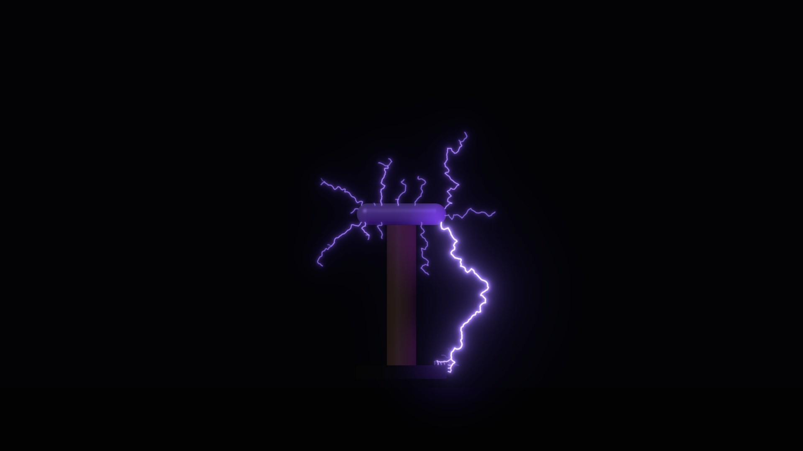
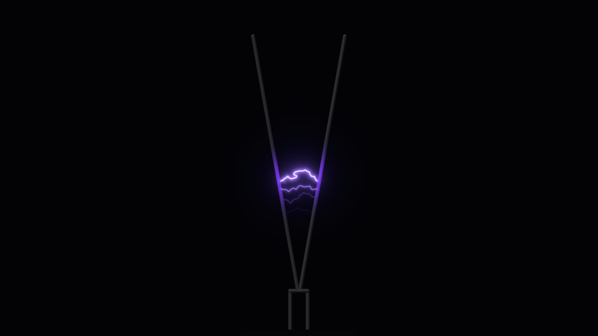
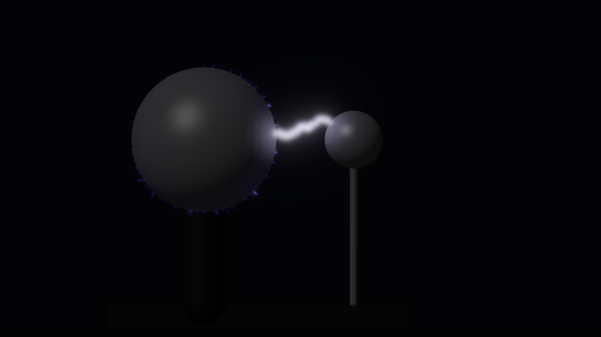
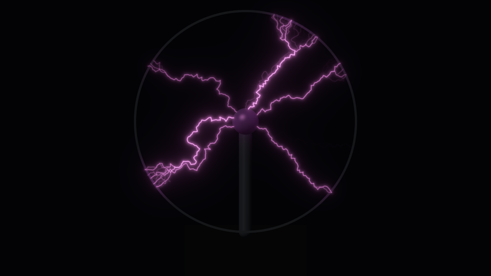
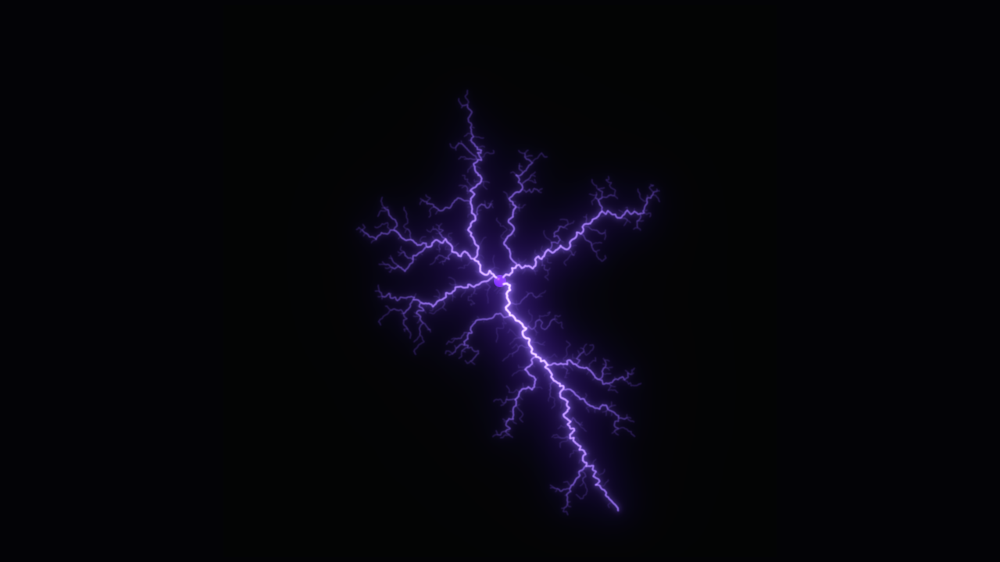
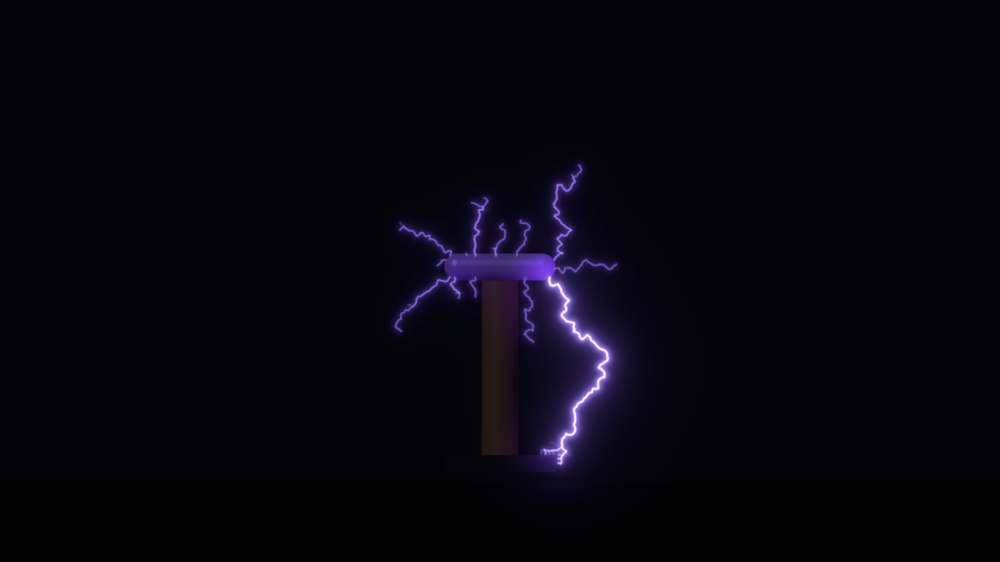
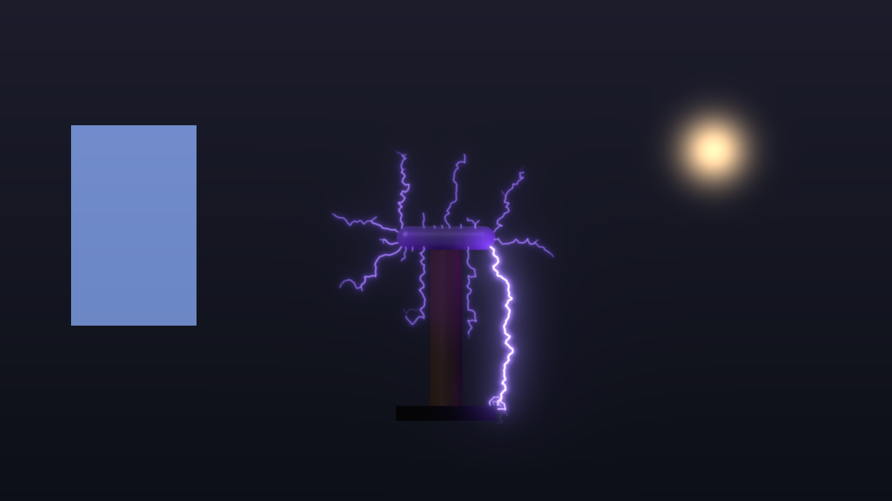

# flyback

> **AI-assisted project.** This codebase was created with [Claude](https://claude.com/claude-code)
> (Anthropic), directed and reviewed by a human author. It has **never been
> loaded into Resolume**. Everything below is measured by an offline harness
> that drives the real plugin class in a headless GL context, and the engine on
> its own where a claim needs no GPU. The central claims are measured, not
> asserted. `hvtest --laplace` holds the potential solver to the coaxial closed
> form within a bound derived from the lattice step. `--dimension` grows
> breakdown-model clusters and finds the fractal dimension of DLA's class,
> **1.744** against the estimator's own reading of true DLA, 1.742. `--ladder`
> puts every arc out at Ayrton's extinction length, found here by bisection
> and matched by the closed form to 1e-9 m. `--vdg` times every spark to
> C·V_b/I_belt, with V_b from image charges that the harness checks against
> both spheres' boundary conditions. `--light` requires each frame to hold the
> event's energy × efficiency to within a derived bound of 4.1e-5 (worst
> measured 1.9e-5; 2.4e-5 at 320×180), however many branches share it.
> `hvtest --negative` re-runs every check against a deliberately wrong model
> and fails if any of them *passes*. `tools/mutate.sh` changes one character of
> the shipped engine or GLSL and requires a check to notice (9 of 9 do). A
> control sweep fails if any parameter turns out to do nothing (see
> [Status](#status)).

High-voltage discharges for Resolume Arena/Avenue: a Jacob's ladder, a Tesla
coil, a Van de Graaff generator, a plasma globe and a Lichtenberg figure. It
comes as two FFGL plugins, a source (`SW Flyback`) and an effect that strikes
into the clip (`SW Flyback Over`).

The Tesla coil as the plugin starts: an NST coil at 120 bangs a second,
streamers into the air and one striking the grounded base. Rendered by the
plugin's offline harness (`hvtest`), not captured from Resolume.

## The one idea

**Air is an insulator until the field tears it, and where it tears is a
Laplace problem.** Every discharge grows by the dielectric breakdown model
(Niemeyer, Pietronero & Wiesmann, 1984). The electrodes and the channel
already grown are held at their potentials. The potential in the air solves
Laplace's equation on a lattice sized in metres of scene. The channel then
extends to a neighbouring site with probability

    p ∝ |∇φ|^η

One exponent decides the look. η = 1 is a Lichtenberg figure. η ≈ 2 to 3 is
lightning. A large η is a nearly straight arc. Nothing is drawn with a noise
function. Branching, forking toward the nearest ground and a strike taking the
short way round are all where the field puts them.

Around that model sit the circuits of the classic machines. Each decides *when*
the air breaks and *how much energy* the channel carries:

- **Jacob's ladder.** The arc obeys Ayrton's equation on a supply with a
  source resistance, so it has an extinction length **L\***, solved in closed
  form. The hot column rises at the buoyant speed, its roots lag on the rods
  and it bows. It stretches as the rods diverge, snaps at L\* and restrikes at
  the bottom. A stiffer supply climbs further.
- **Tesla coil.** Bangs at the interrupter rate, exactly, as a clock. Each bang
  grows streamers off the toroid toward the nearest ground. **Channel memory:**
  a segment stays hot for τ times its share of the current (a thicker channel
  cools slower). So the next bang re-uses what is still hot, and streamers
  lengthen with BPS once 1/BPS < τ. A slow interrupter makes short, fresh
  sparks every time.
- **Van de Graaff.** The belt charges the sphere at I_belt. The gap breaks when
  its surface field reaches Peek's value, from the two-sphere image-charge
  solution, and the spark dumps ½CV². So sparks come every **C·V_b/I_belt**,
  twice as often at twice the belt current. Sphere Finish sets Peek's surface
  factor m: a polished sphere (m = 1) has no corona before sparkover, as Peek
  found. A rough one goes into corona at m·V_b and leaks I_c = G(V − V_c) to
  the room, G derived from ion drift. G is tens of nA per volt against a belt
  of microamps, so the corona does not slow the climb so much as stop it: the
  sphere holds at V_c + I/G, and below V_b it never sparks and glows instead.
- **Plasma globe.** Filaments grow from the electrode to the glass one at a
  time. Each frame each filament's outer part re-forms, so they wander. A
  finger on the glass is a stronger ground that pulls them together.
- **Lichtenberg figure.** The pure model, η = 1, grown from a point or an edge
  until its budget runs out, then held.

**Light, one model for all five.** Current flows in each grown tree by
Kirchhoff: the trunk carries the most. Radius goes as √I, and emission per
metre as I²R = I. A frame's light is exactly the event's energy (½CV² for a
spark, V·I·Δt for an arc) × a luminous efficiency. **A bang split into ten
branches is not ten times brighter.** Colour comes from each gas's own
spectral lines through the CIE observer. A channel moves toward a 6500 K
blackbody as its current nears an ampere, so a strike is white-hot and a
streamer violet. The glow redistributes light and never adds any.

## Controls

- **Machine:** Preset (one per machine), Machine, Fire (a bang, a spark, a
  restrike, a surge, a new figure) and Seed. The same seed and controls grow
  the same bolt, frame for frame.
- **Supply:** Supply (ZVS, NST or Flyback: each a V_oc behind an R_s),
  Voltage and Source Impedance (trims around the supply's own).
- **Discharge:** Branching (η, relative to each machine's own), Detail (lattice
  sites across the scene), Channel Memory (τ) and Reach (growth per event).
- **Jacob's Ladder:** Rod Spread, Rod Length, Rise Speed and Wind.
- **Tesla Coil:** BPS (off, then 5 to 1000), Topload Size, and Target (None,
  Floor or Point) with Target X/Y.
- **Van de Graaff:** Belt Current, Sphere Size, Gap and Sphere Finish (polished
  sparks; a few per cent rough and it sits in corona).
- **Plasma Globe:** Globe Size, and Finger with Finger X/Y.
- **Lichtenberg:** Origin (a point or the bottom edge).
- **Audio:** Audio (Resolume's FFT buffer). Audio Fires turns each onset into a
  bang or a spark (a singing Tesla coil; FFGL has no audio out, so the bangs
  are what you see of the music). Audio Drive raises the supply voltage with
  the level.
- **Light:** Efficiency, Glow, Gas (Air, Neon, Argon, Neon-Xenon), Shutter
  (angle), Persistence (the camera's afterimage, not the air's), Show
  Apparatus (the rods, coil, spheres or globe, lit by the discharge) and
  Background.
- **Over** (the effect): Detect On (luma, alpha or edges), Ground Threshold,
  Illumination (the flash lighting the clip) and Mix. The clip's bright parts
  are ground, so strikes go into the picture and a globe's filaments gather to
  the brightest thing in frame.
- **Layout:** Position X/Y, Scale and Rotation.

The shared controls (Voltage, Impedance, Branching, Detail, Memory, Reach,
Efficiency, Scale) are relative to each machine's nominal, so switching Machine
alone keeps each one's geometry, branching and memory looking like itself.
Supply and Gas are not: switching Machine leaves them where they are set (the
globe's preset uses the Flyback supply and Neon-Xenon, the Lichtenberg's ZVS,
the rest NST and air), so for a machine's usual supply and gas pick its preset. The host panel shows the
physical value: kV, MΩ, η, ms, BPS, µA.

| | | |
| --- | --- | --- |
|  |  |  |
|  |  |  |

Each preset, rendered by `hvtest`: the ladder mid-climb, a Van de Graaff
spark off a polished sphere, a neon-xenon globe, a Lichtenberg figure, the
coil, and the coil over a test clip through `SW Flyback Over`.

## Status

**v0.1.0, 2026-09-23, and honestly early.**

It has **never been loaded into Resolume**. `oxbow probe` reads both bundles
the way a host does and finds `SW Flyback` / `HV01` / source and
`SW Flyback Over` / `HV02` / effect. `oxbow selftest` instantiates each through
the host's own path and renders. Nothing else has run it. There is a
[user guide](docs/USER-GUIDE.md); no OpenFX port and no browser demo. It has only been built and measured on
macOS (Apple Silicon, M4 Max). The Windows build is in CI and has never run.

What is measured, on this machine:

| | |
| --- | --- |
| Laplace solver | coaxial electrode, every free site within its one-lattice-step bound: worst **0.039** (0.65 of its bound) at h = 10.4 mm, **0.016** (0.43) at 5.2 mm |
| fractal dimension | η = 1, six clusters of 3000 sites: **1.744**. The same estimator reads 1.742 on true DLA (literature 1.71). η = 0 gives 2.09, η = 0.5 1.97, η = 2 1.36, η = 6 1.09. Box counting reads DLA as 1.47 at this size, so it is reported and not asserted |
| Jacob's ladder | every extinction at L\* = **0.1338 m** to one lattice step (worst 0.22 mm past it). The straight climb takes the closed-form **0.371 s** to 0.61 ms, the apex rises at the set 1 m/s, and each restrike is at the bottom. R_s doubled gives L\* 0.064 m |
| Tesla coil | **7200** bangs in a minute at 120 BPS, and **2250** at 37.5. Mean streamer **0.254/0.255 m** at 4 and 8 BPS (flat), then **0.365, 0.820, 1.072 m** at 60, 120 and 240 BPS with τ = 20 ms |
| Van de Graaff | polished: every interval **C·V_b/I** = 0.3519 s to 1.3e-11 s (V_b 189.6 kV, C 18.56 pF), and on screen to a frame. Half the belt gives 0.7038 s. 33 image charges hold both spheres to 5e-15 V. In the corona window (m 0.998539): every interval the charging ODE's closed form **0.352393 s** to 8.1e-6 s (bound 9.4e-6), 0.52 ms from the corona-free value. Rough (m 0.95, 0.82): no sparks, held at V_c + I/G to 1e-9 V_b |
| Kirchhoff | every node of every tree, all five machines: worst \|in−out\|/in **1.1e-7**, free tips equal |
| light | frame total against energy × efficiency at 640×360 and 1920×1080, with 5 and 24 free tips: worst **1.9e-5**, inside a bound of 4.1e-5 derived from the kernel's sampling and float32. At 320×180, CI's raster: **2.4e-5**, the same bound |
| exposure | at 360°, 95 of 95 bangs each in one frame. At 180°, 48 of 95, none twice. The pixels agree with the clock in every frame, at two rasters and at 320×180 |
| determinism | 90 frames bit-identical twice with one seed, different with another (coil, ladder, globe) |
| Over | a bright disc in a black clip takes **600 of 600** strikes (chance is 1.8%). A black clip sends all 152 to the coil's grounds |
| audio | the first hit after a fresh instance, and after the clock jumps back, fires |
| GL state | viewport, vertex array, program, units, framebuffer, blend, scissor, clear colour and buffers, as the host left them |
| 320×180 | every pixel check (light, exposure, determinism, Over, onset, GL state) and its negative controls pass again at CI's raster |
| negative controls | **14** wrong models, **all 14** detected, at the development rasters and at 320×180 |
| mutation | **9** one-character mutants of the engine and the GLSL (2 in the GLSL, caught by `--light`), **all 9** caught |
| dead controls | **48** parameters, all live where they apply |

Render cost (`hvtest --bench`; GPU time by `GL_TIME_ELAPSED`, engine CPU time
per frame, on a machine shared with other work while it ran):

| machine | GPU 720p | GPU 1080p | GPU 4K | engine mean | engine worst |
| --- | --- | --- | --- | --- | --- |
| Jacob's Ladder | 0.77 ms | 1.27 ms | 3.21 ms | 1.0 ms | 2.2 ms |
| Tesla Coil | 0.70 | 1.18 | 3.11 | 4.4 | 5.5 |
| Van de Graaff | 0.62 | 1.00 | 3.07 | 1.5 | 6.3 |
| Plasma Globe | 0.76 | 1.04 | 2.88 | 5.0 | 11.0 |
| Lichtenberg | 0.73 | 1.25 | 3.09 | 1.3 | 2.5 |

These come from a run with the load average near 8, and **predate the worker
thread** (64c21d2): "engine" was then time on the render thread. `--bench` now
runs the worker paced at 60 fps and reports the render thread's time and the
worker's time per step separately; the table has not been re-measured since. The same bench inside
`tools/verify.sh`, with more running beside it, measured GPU 1.6–2.4 ms at
720p, 2.1–2.8 at 1080p and 5.1–5.8 at 4K, and a worst engine frame of 12.3 ms
(the globe). Treat the table as a floor and those as a ceiling. Either way a
frame costs well under the 16.7 ms of 60 fps at 1080p. At 4K the worst sum,
engine plus GPU, is about 18 ms under load.

What is **not** verified, and is the honest limit of this release:

- **Never in a host.** How 53 parameters in thirteen groups present, whether
  Resolume's clock arrives in seconds or milliseconds (it is voted on), and
  what its FFT bins really are.
- **The engine runs on a worker thread, one frame late.** Each frame draws
  the engine step started the frame before, so the picture is one frame
  behind the clock, and the very first frame shows the apparatus with no
  discharge light. The render thread waits only for whatever of the engine's
  step (worst 11–12 ms, the globe) did not overlap the host's own work. It is
  bit-exact against the synchronous engine one frame earlier
  (`--determinism`), but has never run inside a host.
- **Some constants are models, not measurements.** The low-current Ayrton
  constants (D = 750 W/m sets the ladder's height), the streamer propagation
  field, the glass's coupling in the globe, a toroid treated as a sphere, and
  the line weights behind each gas's colour. AGENTS.md lists which were carried
  from memory.
- **The Lichtenberg figure grows over three seconds and stays lit.** A real one
  forms in nanoseconds and is a dark fossil afterwards. That is staging.
- **No racing sparks down the Tesla coil's secondary.** The Van de Graaff's
  corona is charged against the belt (C dV/dt = I − G(V − V_c)), but G is
  derived to first order in space charge and the rough-sphere factor is
  borrowed from Peek's cables (AGENTS.md).

## Build

C++17 + GLSL 4.10, CMake, FFGL 2.1 (SDK vendored as a submodule). macOS builds
are universal (arm64 + x86_64); Windows needs GLEW via vcpkg.

    git clone --recursive https://github.com/stoatworks-labs/flyback
    cmake -B build -DCMAKE_BUILD_TYPE=Release
    cmake --build build
    cmake --install build          # both bundles, into Resolume's Extra Effects

## Building and testing

The offline harness renders the real plugin class headlessly:

    ./build/hvtest --out /tmp/f.png --preset 3 --frames 23   a frame (a Van de Graaff spark)
    ./build/hvtest --out /tmp/o.png --effect                  the effect over a test clip
    ./build/hvtest --laplace        the solver against the coaxial closed form
    ./build/hvtest --dimension      fractal dimension against DLA
    ./build/hvtest --ladder         Ayrton's L*, the climb, the restrike
    ./build/hvtest --tesla          the interrupter is a clock; channel memory
    ./build/hvtest --vdg            sparks every C V_b / I
    ./build/hvtest --kirchhoff      current in = current out
    ./build/hvtest --light          light conserved, at two rasters
    ./build/hvtest --exposure       one frame per spark, or none
    ./build/hvtest --determinism    same seed, same frames
    ./build/hvtest --over           strikes go into the picture
    ./build/hvtest --onset          the first hit fires
    ./build/hvtest --negative       every check against a wrong model
    ./build/hvtest --offline        the checks that need no GL context (what CI runs)
    ./build/hvtest --light --size 320x180   any pixel check at another raster
    ./build/hvtest --bench          GPU and engine cost
    python3 tools/sweep.py          no control is silently dead
    tools/mutate.sh                 one-character mutants must be caught
    tools/glslc.sh                  every shader through glslc (verify.sh and CI)
    tools/verify.sh                 all of it, from a fresh universal build

Filming uses the fleet's frame format and cue sheets:

    ./build/hvtest --film 960 --size 1280x720 --script docs/demo.cues \
      | ffmpeg -f rawvideo -pix_fmt rgba -s 1280x720 -r 60 -i - -pix_fmt yuv420p demo.mp4

<!-- attributions:start -->
This project is built on other people's work — see [ATTRIBUTIONS.md](ATTRIBUTIONS.md).
<!-- attributions:end -->

## Licence

MIT.

The physics is from the papers and books ATTRIBUTIONS.md lists: the dielectric
breakdown model, Ayrton's arc, Kelvin's images, Peek's law and the CIE
observer. Nothing is copied from anyone's source.
